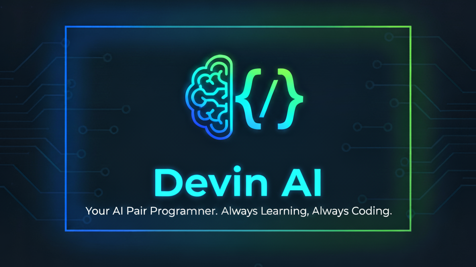

<p align="center">
  
</p>

<p align="center">
  
  
  <a href="https://github.com/md-junaid79/PROJ_DEVIN_AI">
    
  </a>
  
  
</p>

<p align="center">
  
  
  
  
</p>

<p align="center">
  
  
  
</p>

# 
<p align="center"> <h1>🤖 DEVIN AI - Intelligent Personal Code Assistant </h1> </p>

> A sophisticated code analysis and development assistant powered by Large Language Models (LLMs), combining advanced prompt engineering with Retrieval-Augmented Generation (RAG) for intelligent code explanation, refactoring, and debugging.

---

## Table of Contents

- [About](#about)
- [Features](#features)
- [Tech Stack](#tech-stack)
- [Requirements](#requirements)
- [Quick Start](#quick-start)
- [Configuration (.env)](#configuration-env)
- [Usage](#usage)
- [Contributing](#contributing)
- [Author](#author)
- [License](#license)
- [Contact / Support](#contact--support)

---

## About

DEVIN AI is a state-of-the-art code assistant that leverages the power of Large Language Models (LLMs) and Retrieval-Augmented Generation (RAG) to provide intelligent code analysis and improvement. Built with LangChain, Ollama, and advanced prompt engineering, it offers sophisticated capabilities for code explanation, refactoring, and debugging.

## Features

- 🔍 Intelligent Code Analysis & Explanation
- 🛠️ Automated Code Refactoring & Optimization
- 🐛 Advanced Debugging Capabilities
- 🧠 Context-Aware Code Understanding
- 📚 Code Knowledge Base with Vector Storage
- ⚡ Real-time Code Processing
- � Interactive Development Workflow
- 🎯 Modular Tool-based Architecture

## Tech Stack

- Python 3.10+
- LangChain Framework
- Ollama (LLM Backend)
- HuggingFace Embeddings
- Pinecone Vector Database
- Code Analysis Tools
- Interactive UI (Streamlit/Flask)
- Advanced Prompt Engineering
- Tool-based Agent System

## Requirements

- Git
- Python 3.10 or later
- Conda or virtualenv recommended
- Ollama installed and running
- Optional: Pinecone account for vector storage
- Code analysis tools (installed via requirements.txt)

## Quick Start

Clone the repository and create an environment.

``` bash 
git clone https://github.com/md-junaid79/PROJ_DEVIN_AI.git
cd PROJ_DEVIN_AI
conda create -n devinai python=3.10 -y; conda activate devinai
pip install -r requirements.txt
```

If you prefer venv:

```powershell
python -m venv .venv; .\\.venv\\Scripts\\Activate.ps1
pip install -r requirements.txt
```

## Configuration

1. Configure Ollama (if not already set up):
```powershell
# Install Ollama and pull the code model
ollama pull codellama

# Verify installation
ollama run codellama "Hello, World!"
```

2. Optional: Create a `.env` file for Pinecone (if using vector storage):
```ini
PINECONE_API_KEY="your-pinecone-key"
; PINECONE_ENVIRONMENT="your-environment"
; VECTOR_INDEX_NAME="devin-code-index"
```

Keep your keys secret. Do not commit `.env` to source control.

## Usage

1. Generate and store embeddings in Pinecone (if applicable):

```powershell
# adjust the script name if different in your repo
python store_index.py
```

2. Run the Flask app (development):

```powershell
python app.py
```

Open http://127.0.0.1:5000 in your browser.

The assistant will be available at:
- Interactive Mode: Run `python main.py` for CLI interface
- Web Interface: Run `streamlit run app.py` for UI access

Choose the appropriate interface based on your needs:
- CLI Mode: Perfect for direct code analysis and quick iterations
- Web UI: Better for visualizing code changes and longer sessions

Example commands:
```python
# In Python code
from devinai.assistant import ask_devin

# Get code explanation
ask_devin("explain this code", code_snippet)

# Debug code
ask_devin("fix bugs in this function", buggy_code)

# Refactor code
ask_devin("improve this code", code_to_refactor)
```

## Contributing

> Contributions are welcome! Please follow these steps to contribute:

1. Fork the repository.
2. Create a feature branch: `git checkout -b feat/your-feature`.
3. Commit your changes with clear messages.
4. Push to your fork and open a Pull Request.

Guidelines:
- Keep changes small and focused.
- Add tests for new behavior where appropriate.
- Run linters / formatters (black / flake8) if available.

If you'd like help with a contribution idea, open an issue describing it.

## Author

Md Junaid

- GitHub: https://github.com/md-junaid79
- Project: PROJ_DEVIN_AI

## License

This repository does not include a license file by default. If you want to apply a permissive license, consider adding an `LICENSE` file (for example, MIT) and update the badge above.

## Contact / Support

For questions or support, open an issue or contact the author on GitHub.

---

Thank you for exploring this project. If you'd like, I can also:
- Add a LICENSE file (MIT suggested).
- Add a CONTRIBUTING.md and ISSUE_TEMPLATE.
- Generate a minimal GitHub Actions CI workflow to run tests.
